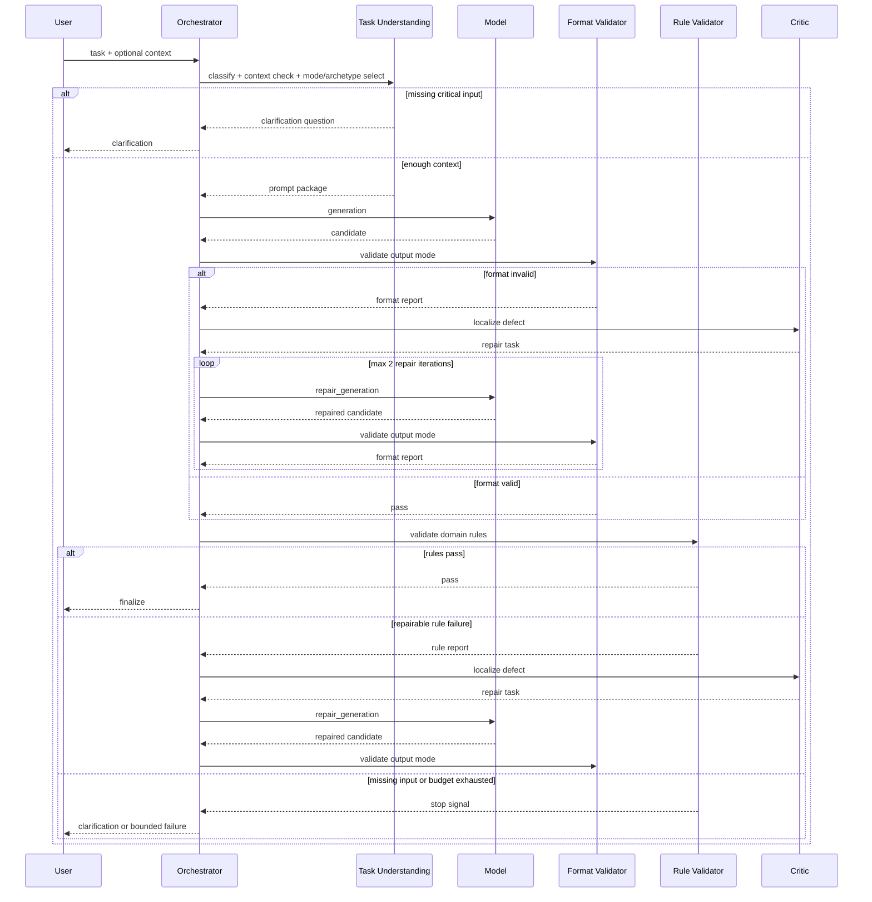

# AGENT PIPELINE SEQUENCE

## Назначение

Этот документ фиксирует sequence diagram для pipeline `S-3`.

## Reading Notes

- `Understanding` объединяет classification, context check, mode selection и
  archetype selection.
- `Critic` не пишет новый answer с нуля, а только формирует repair task.
- bounded repair loop остаётся под управлением `Orchestrator`.
- terminal outcomes ограничены: `success`, `clarification_requested`,
  `bounded_failure`.
