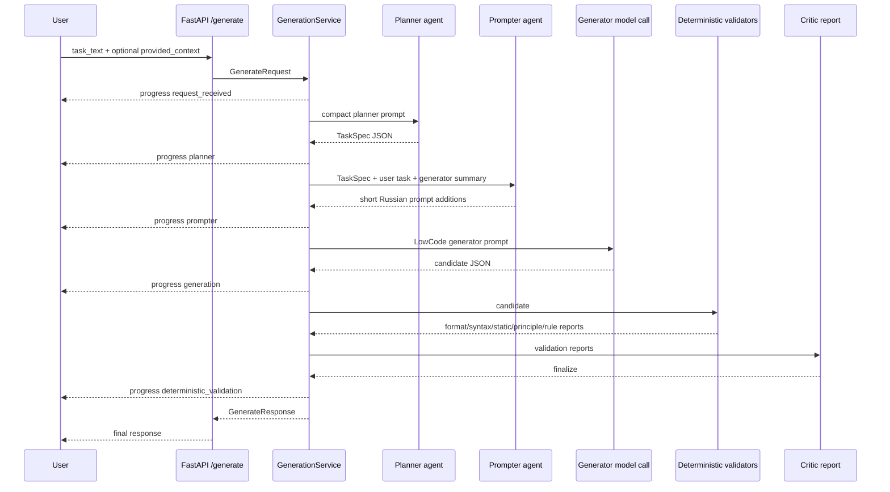
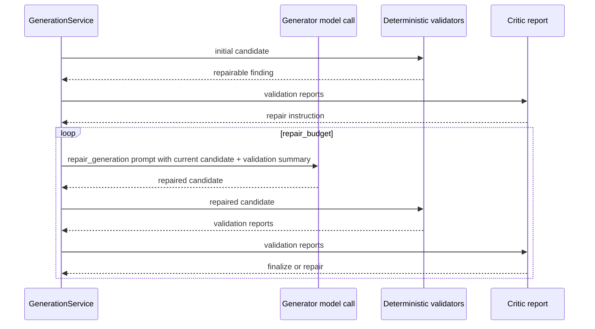

# Agent Pipeline Sequence

Этот документ фиксирует текущую sequence diagram для API path `/generate`.

## Happy path

## Repair path

## Notes

- `planner` and `prompter` are LLM-backed agent layers.
- `generator` is the only layer allowed to emit Lua.
- `prompter` returns only additions, not a full prompt.
- `repair_generation` goes directly to generator. There is no active `repair_prompter` stage in the current API path.
- `deterministic_validation` is not an LLM layer.
- `critic_report` decides whether to finalize or repair based on validator reports.
- Generator stages use truncation guard and temporary files when `eval_count >= num_predict`.
- `/generate/progress` streams progress events while the request is running; `/generate` returns one final JSON response.
